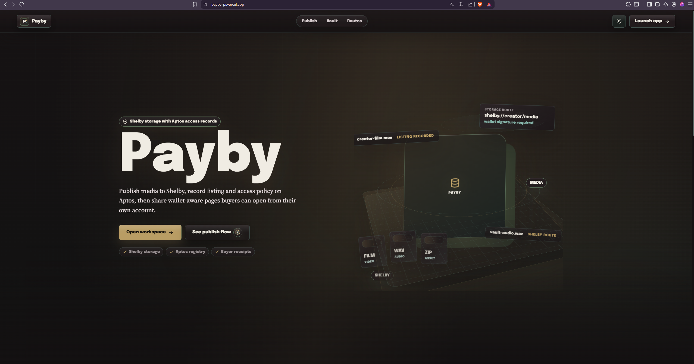

# Payby

<p align="center">
  
</p>

<h3 align="center">A creator media vault built on Shelby and Aptos.</h3>

<p align="center">
  Publish media to Shelby, register ownership and access policy on Aptos, and
  give buyers wallet-scoped access to creator media.
</p>

<p align="center">
  <a href="https://payby-pi.vercel.app"><strong>Open live app</strong></a>
  &nbsp; | &nbsp;
  <a href="https://github.com/biawakLahat/PayBy"><strong>Repository</strong></a>
  &nbsp; | &nbsp;
  <a href="contracts/payby_marketplace"><strong>Move package</strong></a>
</p>

<p align="center">
  
  &nbsp; Shelby media storage &nbsp;&nbsp;&nbsp;
  
  &nbsp; Aptos on-chain registry
</p>



## Overview

Payby is a Web3-native creator media vault for publishing premium media,
creator archives, gated drops, and wallet-aware buyer access. Shelby stores the
media bytes and metadata blobs. Aptos stores the ownership, listing, access,
purchase, revenue, and creator-profile records that define the application
state.

The product has two connected surfaces:

- **Creator workspace**: publish media, manage a Shelby vault, maintain a
  creator profile, inspect network routes, and review sales and activity.
- **Buyer surface**: discover creators, open public media pages, purchase paid
  listings, and recover unlocked media from a wallet-scoped library.

Payby is designed to be inspectable. A user can see the active Shelby route,
Aptos fullnode, contract address, transaction links, Shelby blob routes, and
the metadata commitment associated with a listing.

## Product Model

### Creator flow

1. Connect an Aptos wallet.
2. Select a Shelby route and confirm that the wallet network matches it.
3. Select media files and define title, description, category, tags, visibility,
   access policy, price, currency, and retention.
4. Sign the Shelby blob-registration transaction.
5. Upload the media blob and a Payby metadata blob to Shelby.
6. Sign the Aptos registry transaction that records the owner listing,
   metadata URI, and metadata hash.
7. Wait for Aptos finality and Shelby indexing before the listing is marked
   complete.
8. Share the public media or creator URL.

### Buyer flow

1. Open a public creator or media page.
2. Connect the buyer wallet.
3. Read the listing and access policy from the Aptos registry.
4. Open free media when the policy permits it, or sign `purchase_from` for a
   paid listing.
5. Wait for the purchase transaction to reach finality.
6. Retrieve the Shelby blob and recover the purchase from the buyer library.

## Source Of Truth

| Data | System of record | Purpose |
| --- | --- | --- |
| Media bytes | Shelby | Durable media storage and retrieval route |
| Payby metadata blob | Shelby | Recoverable metadata payload for a listing |
| Listing owner and state | Aptos Move registry | Ownership, title, policy, price, asset, and active state |
| Metadata commitment | Aptos Move registry | `metadata_uri` and SHA-256 `metadata_hash` |
| Purchase receipt | Aptos Move registry | Buyer, creator, blob, price, payment asset, and timestamp |
| Creator sales | Aptos Move registry | Sale count and creator revenue summary |
| Creator profile | Aptos Move registry | Public creator identity and profile update timestamp |
| UI recovery data | Browser cache | Non-canonical local recovery and optimistic UI state |

LocalStorage is not treated as the canonical source of ownership, access, or
purchase state. Chain reads are used to recover listings and receipts when the
browser cache is empty or stale.

## Shelby And Aptos Integration

| Layer | Implementation | Responsibility |
| --- | --- | --- |
| Shelby React SDK | `@shelby-protocol/react@4.1.0` | Upload mutations and blob registration |
| Shelby browser SDK | `@shelby-protocol/sdk@0.7.0` | Browser client and direct storage operations |
| Aptos wallet adapter | `@aptos-labs/wallet-adapter-react` | Wallet discovery, connection, network changes, and signing |
| Aptos TypeScript SDK | `@aptos-labs/ts-sdk` | Fullnode reads, transaction building, submission, and finality checks |
| Payby Move package | `contracts/payby_marketplace` | Owner listings, metadata commitments, profiles, purchases, and sales |
| React frontend | `src/` | Creator, buyer, public, and network inspection workflows |

The Shelby upload path uses the official wallet adapter flow. The Aptos access
registry is built against the selected fullnode and submitted only after the
wallet/network preflight passes. The application also checks the live fullnode
chain ID before opening a publish or registry retry prompt, so a stale wallet
network cannot silently create an invalid transaction.

## Networks

| Route | Aptos wallet network | Shelby RPC | Aptos fullnode | Product role |
| --- | --- | --- | --- | --- |
| Shelbynet | `Network.SHELBYNET` | `https://api.shelbynet.shelby.xyz/shelby` | `https://api.shelbynet.shelby.xyz/v1` | Primary Shelby community route |
| Shelby Testnet | `Network.TESTNET` | `https://api.testnet.shelby.xyz/shelby` | `https://api.testnet.aptoslabs.com/v1` | Early Access validation route |

Shelbynet is a developer prototype network and may be wiped roughly weekly or
faster. It must not be treated as permanent archival storage. Network URLs,
contract addresses, payment assets, and API keys are route-specific and are
configured through environment variables.

The current application does not hardcode a permanent Shelbynet chain ID. It
reads the active chain from the configured fullnode during the publish
preflight. This is important for a prototype network whose infrastructure can
be rebuilt.

Official references:

- [Shelby network architecture](https://docs.shelby.xyz/protocol/architecture/networks)
- [Shelby TypeScript SDK](https://docs.shelby.xyz/sdks/typescript)
- [Shelby React upload guide](https://docs.shelby.xyz/sdks/react/mutations/use-upload-blobs)
- [Aptos wallet adapter](https://github.com/aptos-labs/aptos-wallet-adapter)

## Move Registry

The Move package is located at:

```text
contracts/payby_marketplace/
```

### Shelbynet deployment

The current Payby marketplace deployment is:

```text
0x962ebbcf81cbc5dc0950a8ca036d54828481043f1df8960a2ec4d50fae8c3a12
```

- Module: `payby_marketplace`
- Package: `PaybyMarketplace`
- [Open account on Aptos Explorer](https://explorer.aptoslabs.com/account/0x962ebbcf81cbc5dc0950a8ca036d54828481043f1df8960a2ec4d50fae8c3a12?network=shelbynet)

Because Shelbynet can be wiped, this address should be treated as the current
deployment for the active route, not as a permanent production address.

### Entry functions

The registry exposes entry functions for:

- `initialize`
- `upsert_listing`
- `upsert_listing_with_metadata`
- `upsert_listing_for_owner_with_metadata`
- `upsert_listing_metadata`
- `upsert_listing_metadata_for_owner`
- `upsert_creator_profile`
- `upsert_creator_profile_v2`
- `create_listing`
- `update_listing`
- `purchase`
- `purchase_from`
- `delist`
- `delist_for_owner`

### View functions

The frontend uses view functions for wallet-scoped and public reads:

- `get_listing` and `get_listing_for_owner`
- `get_listing_metadata` and `get_listing_metadata_for_owner`
- `get_listing_count` and `get_listing_count_for_owner`
- `get_listing_key` and `get_listing_key_for_owner`
- `get_purchases` and `get_purchases_from_owner`
- `get_purchase_record_count` and `get_purchase_record`
- `get_sales_summary` and `get_listing_sales_summary`
- `get_creator_profile` and `get_creator_profile_v2`
- `can_access` and `can_access_for_owner`

The paid purchase path transfers the configured fungible asset through Aptos
and records a buyer purchase index, receipt record, creator sale count, and
listing-level sale summary.

## Application Routes

| Route | Surface |
| --- | --- |
| `/` | Landing page |
| `/app/vault` | Creator vault |
| `/app/publish` | Publish media and access policy |
| `/app/analytics` | Creator sales and revenue |
| `/app/discover` | Creator discovery and browsing |
| `/app/library` | Buyer purchases and unlocked media |
| `/app/network` | Shelby and Aptos route inspection |
| `/app/profile` | Creator profile editor |
| `/app/activity` | Wallet-scoped activity and transaction history |
| `/app/blob/<owner>/<blob-name>` | Workspace media detail |
| `/creator/<wallet-address>` | Public creator page |
| `/media/<owner>/<blob-name>` | Public media page |

The landing page is intentionally separate from the workspace. Workspace
navigation uses route-level code splitting and browser view transitions when
the platform supports them.

## Repository Layout

```text
.
├── contracts/
│   └── payby_marketplace/       Aptos Move package
├── docs/                        Product direction and quality gates
├── public/                      Browser icon and public assets
├── scripts/
│   ├── deploy-payby-marketplace.ps1
│   ├── deploy-payby-marketplace.mjs
│   └── readiness-check.mjs
├── src/
│   ├── app/                     Route parsing and navigation
│   ├── components/              Shared UI and workspace components
│   ├── config/                  Network and wallet configuration
│   ├── domain/                  Application models
│   ├── hooks/                   Wallet-scoped stores and data hooks
│   ├── pages/public/            Public creator and media pages
│   ├── pages/workspace/         Vault, publish, analytics, and system pages
│   ├── services/aptos/          Fullnode and wallet boundaries
│   ├── services/payby/          Move registry reads and transaction history
│   ├── services/shelby/         Shelby URI, retrieval, and explorer helpers
│   ├── services/storage/        Browser cache utilities
│   ├── landing.css              Landing page styles; kept separate
│   ├── styles.css               Shared application styles
│   └── workspace-*.css          Workspace design system layers
├── tests/                       Deterministic route, wallet, storage, and state tests
├── assets/readme/               README screenshot and integration marks
├── .env.example                 Environment variable template
├── vercel.json                  Vite build and SPA rewrites
└── vite.config.ts               Vite and Shelby Clay WASM configuration
```

The landing page boundary is deliberate. Workspace design changes must not
modify `src/landing.css`, `src/main.tsx`, `assets/readme/payby-landing-page.png`,
or `public/payby-icon.svg` without an explicit product decision.

## Local Development

### Prerequisites

- Node.js 20 LTS recommended
- npm 10 or newer
- An Aptos-compatible browser wallet for interactive flows
- Aptos CLI only when compiling or deploying the Move package
- Shelby and Aptos API keys for routes that require authenticated access

### Install

```powershell
npm ci
Copy-Item .env.example .env
```

Open `.env` and set the route-specific API keys, marketplace address, and
payment asset metadata addresses required by the flow you want to exercise.

### Start the app

```powershell
npm run dev
```

The Vite server uses `127.0.0.1` and defaults to port `5173`. If that port is
occupied, Vite selects another available port; use the URL printed by the
terminal so the wallet origin matches the active browser tab.

### Build and verify

```powershell
npm run test
npm run build
npm run check:readiness
git diff --check
```

The current deterministic suite covers `22` tests for route serialization,
wallet and network handling, transaction scoping, cache recovery, Shelby path
encoding, Move view behavior, and fullnode response mapping.

`check:readiness` verifies that configured marketplace view functions are
callable and that payment asset metadata is present. It cannot prove a wallet
extension will approve a transaction, nor can it prove Shelby storage survives
a network wipe.

## Environment Configuration

Start from `.env.example`. The most important variables are:

```env
# Frontend route selection
VITE_PAYBY_DEFAULT_NETWORK=shelbynet

# Shelby credentials
VITE_SHELBYNET_API_KEY=
VITE_SHELBY_TESTNET_API_KEY=
VITE_SHELBYNET_LOCATION_HINT=shelbynet-1
VITE_SHELBY_TESTNET_LOCATION_HINT=

# Aptos fullnode credentials
VITE_APTOS_SHELBYNET_API_KEY=
VITE_APTOS_TESTNET_API_KEY=

# Marketplace deployments
VITE_PAYBY_SHELBYNET_MARKETPLACE_ADDRESS=0x962ebbcf81cbc5dc0950a8ca036d54828481043f1df8960a2ec4d50fae8c3a12
VITE_PAYBY_TESTNET_MARKETPLACE_ADDRESS=

# Payment asset metadata addresses
VITE_PAYBY_PAYMENT_ASSET_METADATA=
VITE_PAYBY_APT_PAYMENT_ASSET_METADATA=
VITE_PAYBY_SHELBYUSD_PAYMENT_ASSET_METADATA=
VITE_PAYBY_SHELBYNET_PAYMENT_ASSET_METADATA=
VITE_PAYBY_TESTNET_PAYMENT_ASSET_METADATA=
VITE_PAYBY_SHELBYNET_APT_PAYMENT_ASSET_METADATA=
VITE_PAYBY_SHELBYNET_SHELBYUSD_PAYMENT_ASSET_METADATA=
VITE_PAYBY_TESTNET_APT_PAYMENT_ASSET_METADATA=
VITE_PAYBY_TESTNET_SHELBYUSD_PAYMENT_ASSET_METADATA=
```

The readiness script also accepts server-side aliases for deployment checks:

```env
PAYBY_SHELBYNET_MARKETPLACE_ADDRESS=
PAYBY_TESTNET_MARKETPLACE_ADDRESS=
PAYBY_APTOS_SHELBYNET_API_KEY=
PAYBY_APTOS_TESTNET_API_KEY=
PAYBY_SHELBYNET_FULLNODE_URL=https://api.shelbynet.shelby.xyz/v1
PAYBY_TESTNET_FULLNODE_URL=https://api.testnet.aptoslabs.com/v1
```

`VITE_*` values are bundled into a browser application. Use public or
restricted API keys only. Never commit `.env`, private keys, wallet recovery
phrases, or deployment credentials.

## Move Deployment

The deployment helper supports a dedicated Aptos profile or an explicitly
provided local private-key file. A profile from another project must not be
used.

### Shelbynet

```powershell
powershell -ExecutionPolicy Bypass -File .\scripts\deploy-payby-marketplace.ps1 `
  -Network shelbynet `
  -Profile payby-shelbynet `
  -UpdateEnv
```

### Local signer

```powershell
powershell -ExecutionPolicy Bypass -File .\scripts\deploy-payby-marketplace.ps1 `
  -Network shelbynet `
  -PrivateKeyFile C:\secure\payby-shelbynet.key `
  -Address 0x... `
  -UpdateEnv
```

The key file must remain outside Git. The deployment script compiles the Move
package, publishes it, initializes the registry, and can write the resulting
address into the local environment file.

### Shelby Testnet

```powershell
powershell -ExecutionPolicy Bypass -File .\scripts\deploy-payby-marketplace.ps1 `
  -Network testnet `
  -Profile payby-testnet `
  -UpdateEnv
```

Fund the selected deployer on the selected network before publishing. A
Shelbynet deployment address and transaction history should be considered
ephemeral because the network can be rebuilt.

## Vercel Deployment

The repository is configured as a Vite SPA in `vercel.json`:

- Install command: `npm ci`
- Build command: `npm run build`
- Output directory: `dist`
- SPA rewrites for `/app/*`, `/media/*`, and `/`
- WASM content type handling for Shelby Clay assets

Set the same `VITE_*` variables in the Vercel project environment before
deploying. A push to the configured branch can trigger the project deployment;
the deployment URL must be tested with a wallet extension from the same
browser profile.

## Security And Data Boundaries

- Wallets approve every user-authorized Aptos transaction.
- Payby does not store private keys or recovery phrases.
- Listing ownership and purchase state are read from the Aptos registry.
- Media bytes are retrieved from Shelby using the route recorded for the
  listing.
- Metadata URI and hash commitments are checked before a listing is treated as
  complete.
- Wallet-scoped caches are keyed by wallet and network to prevent one account
  from inheriting another account's activity or purchases.
- API keys in a Vite client are public to the browser; scope and rotate them at
  the infrastructure layer.
- Paid access depends on the configured payment asset metadata and the
  deployed Move registry. An empty payment asset configuration is not a valid
  paid-release setup.

## Current Status

### Implemented

- Shelby media and metadata blob upload integration.
- Aptos Move marketplace package deployed and initialized on the current
  Shelbynet route.
- Owner-scoped listings and metadata commitments.
- Free, allowlist, and paid policy data model in the Move registry.
- Paid purchase and buyer purchase records through `purchase_from`.
- Creator sales, listing sales, and revenue views.
- On-chain creator profile V2 fields, including X handle and verification flag.
- Creator vault, publish, analytics, discover, buyer library, network, profile,
  activity, public creator, and public media pages.
- Wallet-scoped transaction history and pagination-oriented UI states.
- Direct Shelby retrieval while a hardened gateway retrieval layer remains
  deferred until after Early Access validation.
- Automated build, deterministic tests, readiness checks, and landing-page
  boundary checks.

### Remaining release gates

- Complete a funded browser publish with a supported wallet and verify Shelby
  upload, Aptos registry finality, retrieval, and vault indexing together.
- Complete a separate buyer purchase with a second wallet and verify the
  purchase receipt, creator revenue, and buyer library recovery.
- Validate the active wallet's chain ID against the live Shelbynet fullnode.
  On the currently observed environment, the installed Petra native profile
  and live Shelbynet endpoint reported different chain IDs; Payby correctly
  stops before opening a doomed prompt rather than hardcoding a stale value.
- Repeat the creator and buyer flows after a Shelbynet wipe.
- Configure and validate the Shelby Testnet marketplace and payment assets
  after Early Access access is available.
- Run browser accessibility, responsive, wallet-extension, and console-error
  QA with the deployed application.
- Replace the X verification flag with a verified OAuth/attestation flow before
  treating creator verification as a trust signal.

Payby is therefore an active integration candidate, not a claim of completed
community release. The remaining work is primarily funded wallet E2E,
network-specific validation, and operational verification.

## Community Beta Checklist

Use this checklist before inviting external users:

- [ ] Set production Vercel environment variables without exposing secrets.
- [ ] Publish a small free media item from creator wallet A.
- [ ] Confirm the Shelby blob and Aptos listing are both finalized.
- [ ] Open the public media page from a clean browser session.
- [ ] Purchase a paid item from buyer wallet B.
- [ ] Confirm the buyer receipt and unlocked media in wallet B's library.
- [ ] Confirm wallet A sees the sale and updated revenue.
- [ ] Confirm wallet A's activity is not visible in wallet B's activity feed.
- [ ] Open `/creator/<wallet-address>` and verify the public creator profile.
- [ ] Test delisting, failed transactions, retry states, and expired retention.
- [ ] Repeat the supported flow on Shelby Testnet after Early Access is granted.
- [ ] Record transaction hashes and Shelby explorer links for the release report.

## Contributing

Keep changes scoped to the relevant boundary:

- Use `src/pages/public` for public creator and media experiences.
- Use `src/pages/workspace` for authenticated creator and buyer workflows.
- Put chain reads and writes in `src/services/payby` or `src/services/aptos`.
- Put Shelby route and URI behavior in `src/services/shelby`.
- Keep browser cache behavior in `src/services/storage` and never promote it
  to canonical state.
- Update `tasks.md`, `memory.md`, and `soul.md` when a tracked integration or
  product decision changes.
- Preserve the landing-page boundary unless the change explicitly targets the
  landing experience.

Before opening a pull request:

```powershell
npm run test
npm run build
npm run check:readiness
git diff --check
```

## License

No license has been declared for this repository yet. Do not reuse the code
outside the repository until a license is added by the project owner.
